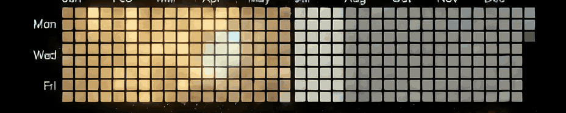

# Hi, I'm Mohammed Haji 👋

**Full-stack developer** — I build real-time web apps that feel alive.

---

## 🚀 Featured project

### 🎶 [EchoVote](https://github.com/Mohammed-Haji/echovote)

Real-time, QR-code-based song voting for public venues — guests scan, search YouTube, and vote; the crowd decides what plays next. Glass-inspired UI, live sync, race-safe voting, and a 153-test suite.

`React` · `Node.js` · `Socket.io` · `MongoDB` · `Docker` · `JWT + TOTP 2FA`

---

## 🛠️ Tech stack

---

## 📊 GitHub stats

🌊 Building things for the web.

